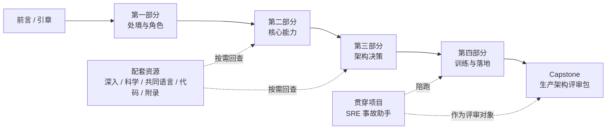

# 学习路线图

> [← 返回目录](README.md)

这本书现在按“主书 + 配套资源”组织。主书负责建立完整判断链路；配套资源负责在具体问题上加深。第一次学习时，先走主书，不要被深入专题和工具材料分散。

> [!IMPORTANT]
> 主线不是“读完所有 Markdown”。主线是：理解处境 → 建立能力 → 形成架构判断 → 用项目训练。

---

## 1. 一张图看全书

这张图里的箭头代表思路递进，不代表所有章节都必须一次读完。真正需要一口气读的是主书四部分；配套资源随问题回查。

---

## 2. 标准路线：20 周

标准路线适合传统 SRE、平台工程师、AI 应用工程师，也适合没有明确项目压力但想系统转型的人。

| 阶段 | 时间 | 必读 | 产出 |
|---|---|---|---|
| 启动 | 1 周 | [前言](00-前言.md)、[引章](01-引章-大模型速览.md)、第 1-3 章 | 写下你要训练的真实场景 |
| 能力地图 | 1-2 周 | 第 4-9 章 | 一页 AI SRE 能力自评 |
| 架构判断 | 1-2 周 | 第 10-16 章 | 一张参考架构图和一份风险清单 |
| 周训练 | 19 周 | 第 17-19 章、Unit 0-5 | 贯穿项目持续增量 |
| 收束 | 1 周 | 第 20 章 | AI 生产架构评审包 |

如果时间紧，启动、能力地图和架构判断可以压缩到一周；周训练不要压缩得太狠，因为它训练的是手感，不只是知识点。

---

## 3. 三条读者路线

### 路线 A · 完整训练路线

适合希望系统完成转型的 SRE。

1. 读主书第 1-16 章。
2. 从第 17 章开始建立 B1/B2/B3 周循环。
3. 按 Unit 0-5 推进贯穿项目。
4. 最后做 Capstone。

这条路线慢，但最稳。它把”我知道这个概念”变成”我能在项目里交付这个产物”。

**走完后的产出**：一个跑得动的 SRE 事故助手系统 + 一份完整的 AI 生产架构评审包。这两样东西就是你从”传统 SRE”到”AI SRE 架构师”的转型证据——可以拿去面试、晋升或直接用于当前团队的 AI 系统评审。

### 路线 B · 架构师快读路线

适合技术负责人、架构师、管理者，或者已经有 AI 系统需要评审的人。

1. 读第 4-9 章，快速补齐核心能力语言。
2. 精读第 10-16 章。
3. 用 [附录 E · 模板库](附录/E-模板库.md) 和 [第 20 章 Capstone](练习/Capstone-AI生产架构评审包.md) 评审当前系统。
4. 遇到具体问题再回查深入专题。

这条路线的目标是能开评审会：说清系统在哪一档、缺哪个面、下一步改什么、哪些决策不可逆。

**走完后的产出**：一份当前系统的架构评审报告——包含参考架构图、RACI 矩阵、成熟度自评、不可逆决策清单和预算治理建议。你可以在接下来一周的团队评审会上直接用这份报告。

### 路线 C · 项目驱动路线

适合手里已经有 AI 应用、Agent、RAG 或 LLM 网关项目的人。

1. 先画出当前系统的组件图。
2. 对照第 10 章，标出缺失或合并的组件。
3. 按短板回查第 4-9 章和深入专题。
4. 选择 1-2 个 Unit 深做，不必机械跑完整 19 周。
5. 用 Capstone 做一次阶段性收束。

这条路线的关键是不要为了读书而读书。让项目暴露你该学什么。

**走完后的产出**：当前系统的"差距分析报告"——缺哪些组件、关键风险在哪、下一步优先级排序。它不是一份全面的架构评审（那是路线 B 的产出），而是一份"从当前状态出发的最短路径"——你明天就能拿去找老板要资源或推动改动。

---

## 4. Unit 与章节对应表

| Unit | 训练主题 | 主要回查章节 | 常用配套资源 |
|---|---|---|---|
| Unit 0 | AI 大模型上手 | 引章、第 17-19 章 | [代码 README](代码/README.md)、[厂商学习资源](附录/D-厂商官方学习资源.md) |
| Unit 1 | Agent 自治与致命三角 | 第 6 章、第 10 章 | [Prompt Injection 红队](深入/07-Agent-Prompt-Injection红队实战.md)、[何时不该用 AI](深入/09-何时不该用AI.md) |
| Unit 2 | Trace-Eval 统一可观测性 | 第 7 章、第 13 章 | [Eval Pipeline](深入/06-Eval-Pipeline设计.md) |
| Unit 3 | 推理 SLO 与静默降级 | 第 5 章、第 15 章 | [TTFT 与吞吐](深入/01-首包延迟与吞吐的影响因素.md)、[容量规划](深入/05-LLM推理服务的容量规划.md)、[成本工程](深入/18-LLM成本工程.md) |
| Unit 4 | 复合 AI 可靠性数学 | 第 4 章、第 12 章 | [AI 系统事故模式库](深入/10-AI系统事故模式库.md)、[现实图谱](深入/11-AI-SRE现实图谱.md) |
| Unit 5 | 数值与编译器级调试 | 第 9 章 | [Quantization](科学/03-Quantization为什么有时坏.md)、[Tokenization](科学/04-Tokenization的坑.md) |

---

## 5. 最容易走错的路

- **把深入专题当主线**：会越读越散。深入专题应该在你遇到具体问题时打开。
- **只读不做项目**：会形成“看过”的错觉，却没有系统经验。
- **只做代码不写评审文档**：能力会停在 demo，无法进入架构讨论。
- **把 AI 当总结器**：这会复现本书最警惕的认知外包。
- **跳过复习和自检**：19 周后你可能记得自己读过，但不一定能在事故现场用出来。

---

## 6. 最小承诺

如果你时间很少，只做这 5 件事：

1. 读 [第 1 章](理念/01-AI时代工程师的真实处境.md)。
2. 读 [第 10 章](架构/01-AI系统参考架构.md)。
3. 读 [第 17 章](练习/10-三个核心训练动作.md)。
4. 做一个最小版 [贯穿项目](练习/贯穿项目-SRE事故助手.md)。
5. 用 [第 20 章 Capstone](练习/Capstone-AI生产架构评审包.md) 评审它。

做到这 5 件事，比浏览完整个目录更有价值。

---

[← 返回目录](README.md) · [开始周循环 →](练习/周循环总览.md)
