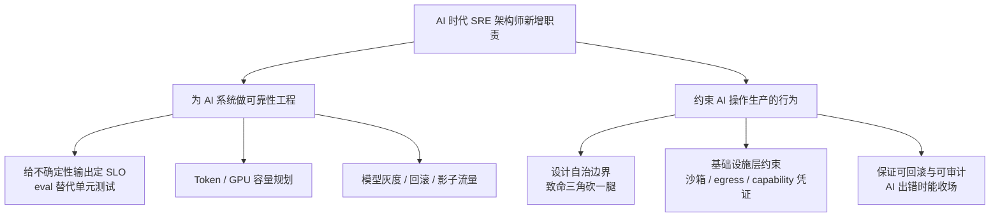

# 第 2 章 · SRE 架构师的角色迁移

> 所属：第一部分 · 处境与角色  ·  [← 返回目录](../README.md)

传统 SRE 架构师的关键词是 SLO、error budget、可用性工程、失败域设计——围绕**确定性分布式系统**打转。AI 时代的关键词多了一类：推理 SLO、eval、致命三角（第 6 章）、数值级调试（第 10 章）。关键词单子长出了新的一半，是因为运维的**对象本身**变了。

这一章说的是：运维对象变了，SRE 架构师的角色随之迁移，**护城河也在同步换位**。

## 运维对象为什么变了

传统系统也会以意外的方式坏——尾延迟、灰色故障、级联失败——但"坏没坏"是可以写成规则判定的：你写一条 Prometheus 规则 `rate(http_requests_total{code="500"}[5m]) > 0.01`，它要么触发要么不触发，没有"大概触发"。这个前提在 AI 系统里不再成立：

- 系统里出现了**非确定性组件**：LLM 推理、AI Agent、自主决策的链路。同样的请求跑两次，可能得到不同答案——你没法写一条规则说"这个回答是错的"，因为"对"本身就是模糊的。同样的 prompt 在模型升级后行为会漂移，而你甚至不知道厂商什么时候悄悄升了级。
- AI 自己也开始**作为操作者**进入生产环境：它可以读文档、调工具、改配置、跑命令。以前你写 runbook 是给人看的，现在 Agent 也在读你的 runbook 然后自己执行。以前 "operator" 一定指人，现在不是。

这两件事各自都在颠覆 SRE 已有的方法论。合在一起就意味着：**以"失败可判定"为前提构建的整套可靠性工程，需要换一层地基**。

## AI 时代 SRE 架构师多出来的两类新工作

- **为 AI 系统做可靠性工程**：给不确定性输出定 SLO，给 Token 和 GPU 做容量规划，给模型做灰度 / 回滚 / 影子流量（shadow traffic——把生产请求复制一份发给新版本，不影响用户，用于对比新旧版本表现），用 eval 替代传统单元测试在发布链路中的位置。
- **约束 AI 操作生产的行为**：设计自治边界——本质是给致命三角（私有数据访问、不受信输入、外泄通道三者并存时，Agent 就可能被 prompt injection 利用完成完整攻击链，[第 6 章](../知识/06-AI自治与上下文架构约束.md) 展开）至少砍掉一条腿；建立**不可逾越的基础设施层约束**——沙箱、egress 白名单（只允许访问明确列出的外部地址，即出站流量白名单）、capability-scoped 凭证（权限范围严格限定的临时凭证，只授予完成当前任务所需的最小权限）——在 AI 被 prompt injection 诱导或自身出错时，保证系统仍可回滚、可审计。

这两类工作**不能外包给 MLOps 或 AI 安全团队**。它们本质上是可靠性问题——谁兜底谁就该设计。SRE 架构师不接，就等于把生产环境的兜底权交出去。

## 这个角色迁移不是什么

角色迁移容易被误读成几种东西，先排除：

- **不是转岗做 ML**。架构师不用去做训练、炼 loss、调超参。新增的是对**推理系统**的工程判断，不是对**训练系统**的实操。
- **不是把原来的能力丢掉**。经典分布式、失败域、容量规划、SLO 谈判一个都不能少——它们现在是**底座**，上面才是 AI 相关新工作。
- **不是"学会用 AI 工具"**。会用 AI 写代码不等于会为 AI 系统做可靠性工程。前者是生产力工具使用者，后者是系统设计者，不是同一个岗位。

## 护城河在同步换位

**会操作、会写 runbook、会按图谱排查**这些传统能力，正在被 AI 蚕食——不是"被替代掉了"，是"替代的速度在加快"。你花三年练出来的"看到 OOM 先查 cgroup 再查 JVM heap"的肌肉记忆，AI 现在 5 秒就能给出同样的排查路径。想用这些能力建职业壁垒，会越来越难。

**真正升值的那些能力**在另一边：

- **判断哪些事该交给 AI**：业务方说"让 Agent 自动处理退款"，你要能说"不行，退款涉及资金操作且不可回滚，必须人工确认"。有些事 AI 做了反而更危险，架构师要能画边界。
- **承担 AI 错误的后果**：事故发生后 AI 不会被 paged，是你被 paged。你不能对老板说"是 AI 干的"——责任本身在 AI 那里无法承担，只能回到人。
- **在事故中做组织决策**：一场 P0 事故里，谁先恢复、谁通知客户、邮件怎么措辞、后续怎么推进整改——这套"人在做的工程"一点没变，含金量反而上升。AI 能帮你写 postmortem 草稿，但不能替你在复盘会上拍桌子说"这个 action item 必须本周关掉"。
- **对"应该不应该"的第一性判断**：第 9 章会专讲这块。

一句话：**你的价值不在"会不会做"，而在"会不会判断"**。这话不是鸡汤——它背后是一件具体的事：所有"会做"型能力在贬值，所有"会判断"型能力在升值。

为什么上面这四点是同一类、而且都不会贬值？因为它们落在同一条分界线上：**能不能连责任一起外包出去。** "会做"的事可以整层外包给 AI——错了可以重跑、可以在验收时被拦下，追责终点是"谁验收"，不必是你；而判断不行——点头的人没有再往后甩的地方：业务方真按你点头的方案上线、退款真多赔了 40 倍时，被 paged、被复盘、要在会上签字的是你，不是模型。一件事一旦无法连责任一起外包出去，它就留在了人这一侧，而且 AI 越强、能外包的"会做"越多，这条线另一侧的判断就越值钱。（这条线为什么对整个职业、乃至这场生产力飞跃都成立，[第 9 章](../知识/08-组织与判断力.md) 和 [结语](../99-结语.md) 会接着讲。）

## 接下来

- **下一章**：[第 3 章 · 学习能力才是新的护城河](03-学习能力才是新的护城河.md) —— 判断力从哪里来？从不断重建心智模型的学习能力来
- **关联知识章节**：从第 4 章开始的六维能力画像，逐一展开上面两类新工作
- **关联练习**：[贯穿项目 · SRE 事故助手](../练习/贯穿项目-SRE事故助手.md) —— 把这两类新工作缩到一个可做的最小产品上

🔄 复习：[核心概念卡](../复习/核心概念卡.md) · [Active Recall 题库](../复习/Active-Recall题库.md)

---

上一章 → [第 1 章 · AI 时代工程师的真实处境](01-AI时代工程师的真实处境.md)
下一章 → [第 3 章 · 学习能力才是新的护城河](03-学习能力才是新的护城河.md)
