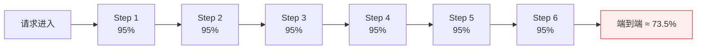
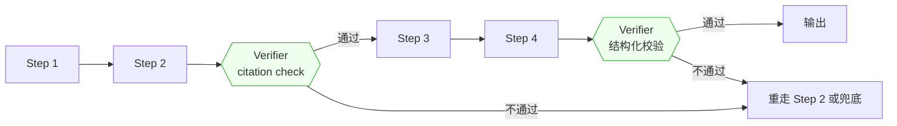

# 第 4 章 · 系统架构与复合 AI 可靠性数学

> 所属：第二部分 · 核心能力  ·  [← 返回目录](../README.md)

经典架构设计——失败域、容量、多活、tradeoff 表达——在 AI 时代**没有过时**。但架构师要在这些能力之上，多掌握一件事：对复合 AI 系统算一笔**可靠性账**。这一章说的就是这笔账怎么算，以及为什么不算它的系统，一上线就是赌博。

## 为什么需要复合 AI 可靠性数学

一个典型的 AI Agent 业务链路看起来像这样：**理解意图 → 检索上下文 → 调工具 A → 调工具 B → 生成回复 → 结构化输出校验**。6 步看起来不多——传统微服务调用链 6 跳也很常见。但每一步都不是确定性的——LLM 的单步正确率就算做到 95%（已经很高了），链路的端到端正确率是：

$$
P_\text{end-to-end} = 0.95^6 \approx 0.735
$$

也就是说，每 4 次交互中就有 1 次以上会在某一步出错。这个数字对 SRE 来说触目惊心——传统服务 73.5% 的成功率连 1 个 9 都不到。业务同学看到的"AI 好像老出问题"，背后的数学就是这条乘积曲线。

这个结果反直觉，但完全可推导。架构师如果不在设计阶段就把这条曲线画出来，业务团队会按**单步可靠性**的直觉去堆 step 数——结果就是上线即灾难。

推论也很直接：

> **每多一步，都要有明确的边际收益作交代——否则就是在烧端到端可靠性。**

### 步数对端到端可靠性的定量影响

下面这张表用同一个场景（单步 95% 正确率）走不同步数，让你直观感受乘积衰减的威力：

| 步数 | 端到端正确率 | 故障率 | 相当于 |
|---|---|---|---|
| 3 | 85.7% | 14.3% | 约 1/7 的请求会出问题 |
| 6 | 73.5% | 26.5% | 约 1/4 的请求会出问题 |
| 10 | 59.9% | 40.1% | 约 2/5 的请求会出问题 |
| 15 | 46.3% | 53.7% | 超过一半的请求会出问题 |

就算单步正确率提升到 99%（非常高），10 步链路的端到端也只有 90.4%。这意味着**10 步链路里，每 10 次请求就有 1 次会在某一步出错**。对于传统 SRE 来说，90.4% 的成功率相当于只有 1 个 9——而这已经是"单步很优秀"的链路了。

这个表格不是纸上的数学游戏。在真实生产环境中，每增加一步的代价是：
- **成本**：多一轮 LLM 调用的 token 消耗
- **延迟**：多一轮网络往返 + 推理时间
- **可靠性**：乘积衰减

三样代价里，工程团队最容易忽略的是可靠性——因为它不像成本和延迟那样直接可见。"就加一步 reasoning"听起来无害，但多 10% 延迟是线性、可见的代价，而这一步砍掉的可靠性是乘进端到端成功率的一刀——6 步变 7 步，故障率就从 26.5% 涨到 30.2%（0.95^7 ≈ 69.8%）。

## 传统"单模型 SLO"为什么不够用

传统在线服务的可靠性计算是**串联式的**，每个微服务单独算 SLA、相乘得到整体——这套方法在 AI 系统里依然适用，但漏掉了两件事：

- **语义级错误不计入 SLA**。微服务返回 200 就算成功，但在 LLM 里 200 响应可能内容是错的。单看 HTTP 层的 SLA 永远看不到这类问题。
- **步数会被业务团队随意加**。微服务拓扑里加一个 call 是显性的；Agent 链路里加一个工具调用或中间 reasoning step，几行代码就行。**架构师不把 step 预算列出来，它就不存在**。

所以这一章要建立的不是一套替代品，而是一套**叠加层**：在传统 SLO 之上，加一层"链路级可靠性账"。

## 架构师因此必须做的两件新工作

基于上面的乘积数学，架构师在 AI 系统设计里有两件传统架构设计不包括的新工作：

- **Step 预算**：一条业务链路**最多**容忍多少步？每多一步的**边际收益**是什么？超过预算的 step 必须裁剪或合并。这和你熟悉的 P99 latency budget、后端的 QPS budget 是同一类工程语言——只是约束的维度换成了"步数"。就像你不会让一个 API 调用链无限加 hop 一样，Agent 链路也不能无限加 step。
- **Verifier 插入点**：在哪里加**校验节点**（retrieval 核验、citation check、LLM-as-judge、结构化输出校验），能把累积误差在某一点截断、重置？打个比方：传统流水线里你会在关键节点加 health check，这里的 verifier 就是 AI 链路里的 health check——只不过它检查的不是"服务活着没"，而是"输出对不对"。Verifier 本身也有代价（延迟、成本、假阳性），所以它的位置和数量都要算。

Verifier 的工程价值在于：把一条长乘积切成几段短链——每段末尾的 Verifier + 重试把该段的有效可靠性抬回接近 1，误差被截断在段内、不再跨段累积。各段仍然相乘，但乘的都是接近 1 的数，端到端可靠性就能救回来。

> [!WARNING]
> **何时"压缩 step 数"不再是第一优先**：Step 预算这件事，底层假设是**每步都不完美、误差会沿链路乘积衰减**——所以步数越少越安全。这个假设会被两件事推翻：① **单步可靠性跨过 99.9% 阈值**（模型在你的任务上把每步正确率做到 99.9%+，短链路里乘积衰减就不再是主要风险）；② **链路改造成可验证、可回滚的事务式结构**（每步都能原子提交/回滚，错了不累积）。任一成立，约束就从"最小化步数"翻转为"**最大化每步的可验证性与可回滚性**"——多几步但每步可回滚，可能比少几步但一错到底更可靠。乘积数学没变，变的是哪个变量是瓶颈。

### 一笔具体的账：加一个 Verifier 值多少钱

假设 6 步链路，每步 95% 正确率，无 Verifier：

$$P_\text{无 Verifier} = 0.95^6 \approx 73.5\%$$

现在在第 2 步后插入一个 Verifier（citation check），假设 Verifier 本身正确率 99%：

$$P_\text{加一个 Verifier} = (0.95^2 \times 0.99) \times (0.95^4) \approx 89.3\% \times 81.5\% \approx 72.7\%$$

等等——加了 Verifier 好像**更差了**？

不是算错了。单一 Verifier 插入一段**无重试**的链路，Verifier 自身的那 1% 误判率也会吃掉一部分可靠性。**这就是为什么 Verifier 的设计不是"随便插一个就好"**——你必须有重试/兜底机制，否则 Verifier 只是多了一个故障点。

现在加上重试逻辑：Verifier 不通过时重走 Step 2（不是从头重走）。假设 Verifier 以 99% 的概率识别出错误输出，重走的 Step 2 仍按 95% 单步正确率计：

$$P_\text{加 Verifier + 重试} = 0.95 \times (0.95 + 0.05 \times 0.99 \times 0.95) \times 0.95^4$$
$$\approx 0.95 \times 0.997 \times 0.815 \approx 77.1\%$$

括号里的三个因子依次是：0.05（Step 2 首次出错）× 0.99（被 Verifier 拦下）× 0.95（重走成功）。和上一个算例还有一处口径差异要交代：有重试时，Verifier 误拒一个正确输出不再是失败，只是多触发一次重试，所以成功路径不再乘 0.99——这个二阶修正项极小，此处忽略。

从 73.5% 提升到 77.1%——端到端的故障率从 26.5% 降到约 22.9%，降掉约 1/7。如果插入两个 Verifier（第 2 步和第 4 步后各一个），端到端正确率约 81%（0.95^4 × 0.997^2）。

**这笔账给架构师的启示**：
- Verifier + 重试 ≠ 免费午餐——Verifier 本身的延迟和成本要算进去
- 一个位置选得好的 Verifier + 重试，大约能抵消 1 个额外 step 的可靠性损失——5 步裸链路是 0.95^5 ≈ 77.4%，和 6 步加 Verifier 的 77.1% 相当
- 多个 Verifier 的收益递减——第一个 Verifier 提升最大，第三个可能不如把单步质量提上去划算

## 这一章不讨论什么

几个需要提前界定的边界：

- **不是讲概率论基础**。上面的乘积公式是基础高中数学，这里只拿来用。读者需要的是"能在方案评审时把这张图画出来"，不是"能证明概率的独立性假设"。不过有一点要挑明：乘积公式假设各步出错**相互独立**，而真实链路里误差往往是相关的——上一步跑偏，后面几步会跟着一起错，而不是各自独立掷骰子。所以这条曲线是评审用的**方向性模型**：用来比较"多一步值不值"、给 step 预算定档，而不是当成端到端 SLA 的精确预测。
- **不是替代单机可靠性工程**。单点 SLA、失败域、多活——这些仍然要做。复合可靠性**建立在**单步可靠性之上，不是替代它。
- **不是讲模型训练**。这里关心的是"模型已经给定，链路怎么设计"；模型本身怎么训出来超出架构师职责。

## 接下来

- **关联练习**：[Unit 4 · 复合 AI 可靠性数学](../练习/Unit4-复合AI可靠性数学/总览.md) —— 把 Step 预算与 Verifier 做成可评审的文档
- **下一章**：[第 5 章 · AI 推理服务的可靠性工程](05-AI推理服务的可靠性工程.md) —— 单步可靠性怎么做（链路可靠性的必要前提）
- **深入专题**：[深入 10 · AI 系统事故模式库](../深入/10-AI系统事故模式库.md) —— 真实发生的链路级事故

🔄 复习：[核心概念卡](../复习/核心概念卡.md) · [Active Recall 题库](../复习/Active-Recall题库.md)

---

上一章 → [第 3 章 · 学习能力才是新的护城河](../理念/03-学习能力才是新的护城河.md)
下一章 → [第 5 章 · AI 推理服务的可靠性工程](05-AI推理服务的可靠性工程.md)
