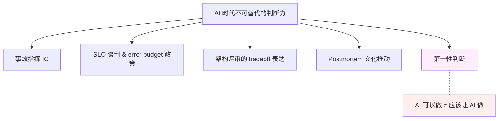

# 第 9 章 · 组织与判断力

> 所属：第二部分 · 核心能力  ·  [← 返回目录](../README.md)

这一章讨论的是一块只要责任仍然无法外包、AI 就接不走，而且价值还在上升的能力。前面几章讲的都是"AI 来了，方法论要换"。这一章反过来——有些东西不换，只是价值更高。

## 为什么组织与判断力在 AI 时代反而升值

AI 能替代很多能力，但它**无法承担后果**。所有"需要有人兜底"的事，都必须由人做，且在 AI 时代这些事被**更密集地需要**：

- 事故发生时——AI 可以在告警响起时先冲进去排查，但对事故结果签字负责的不是它。凌晨三点 PagerDuty 响的时候，为后果兜底的是你，不是 Claude。
- 架构评审时——AI 能列 tradeoff，但在业务、合规、成本之间**取舍到哪一条**，必须由对后果负责的人决定。AI 可以告诉你"方案 A 便宜但有合规风险"，但"我们承受这个风险"这句话只能你来说。
- 方案设计时——AI 能告诉你"这件事技术上能做"，但"**应该不应该让 AI 做**"的判断只能是人的。业务方兴冲冲说"让 Agent 自动审批报销"，你要能说"不行，这涉及财务合规"。

这些事一个共同点：它们处理的是**责任**，不是**能力**。责任本身在 AI 那里无法承担，只能回到人；而 AI 越多、系统越复杂、出错方式越隐蔽，**需要人来兜的事反而更多**。

## 这是硬能力，不是"软技能"

讲到这里要先纠一个认知，否则下面五项能力会被自动打折。

很多工程师把这一章的内容归到"软技能"那一格——言下之意：相对代码这种"硬"本事，它是次一等的、谁都能做的、不值得专门练的。**这是个会害你的误判。** "软"这个词带着贬义，但这些能力一点都不软：一场 P0 事故里 IC 调度失当，损失以小时和百万计；一份 SLO 文档说不动 CFO，整个团队的可靠性预算就拿不到；一次架构评审 tradeoff 讲不清，几百万的不可逆决策就拍错。这些后果的量级，不比任何一个线上 bug 小。

更关键的是：在 AI 时代，"会写代码"这类硬本事正在被 AI 快速蚕食（见 [第 2 章](../理念/02-SRE架构师的角色迁移.md)），而本章这组能力恰恰是 AI 接不走的——因为它们的内核是**为后果负责**，而责任无法外包。所以正确的二分法不是"硬技能 vs 软技能"，而是"**能连责任一起外包出去的 vs 不能的**"。这一章讲的，全是后者。把它们当软技能，等于主动把自己最不会贬值的资产标成了次等品。

## 核心能力五项

这一章对应的不是一块孤立知识，是一组互相支撑的**硬能力组**：

- **事故指挥（Incident Commander, IC）**：组织人、分发信息、做 tradeoff、对外沟通。事故里的最大成本从来不是技术问题本身，而是**信息和决策的混乱**——IC 是专门处理这个的角色。
- **SLO 谈判与 error budget 政策**：能和产品、业务团队把"多一个 9 要多花多少、为什么值得"讲清楚。这本质是一次**商业对话**，不是技术对话。文档 AI 可以代笔，但能说服 CFO 的从来不是文档，而是站在数字后面、能为预算后果负责的人——这个位置 AI 站不了。
- **架构评审中的 tradeoff 表达**：能在黑板上画出**三个方案的成本、收益、失败模式**。评审的价值不在于"选出最好的方案"，而在于让所有利益方在**同一张图上看清取舍**——AI 能列出取舍，但撮合在场的人认领取舍、并为选择签字的，只能是主持评审的人。
- **Postmortem 文化的推动**：blameless 复盘、可执行的 action item、组织级的记忆沉淀。文化属于**组织级的事**，需要持续有人推、有人守住底线，AI 没有组织推动能力。
- **第一性判断**：某件事 AI **可以做** ≠ **应该让 AI 做**。对"应该"的判断是架构师的职业核心——它不能被模型能力替代，因为它判断的恰恰是"模型能力本身的边界"。

## 这一章不讨论什么

- **不是讲管理学**。这里不是"领导力通识课"，只关心 SRE 架构师岗位场景里的五项具体动作。管理学书市面上太多，这本书不替代。
- **不是讲 IC 的操作细节**。IC checklist、事故升级流程、SEV 分级——这些是执行层，具体组织内部文档更合适。本章关心的是"为什么这个能力在 AI 时代特别重要"。
- **不是穷举所有组织能力**。本章只挑出与"为 AI 系统的后果负责"直接相关的五项；通用的向上管理、团队建设、跨部门协作等，不在本书镜头里。（至于"这些是不是软技能"——上一节已经讲过：它们是硬能力，别打折。）

## 这块能力怎么训练

注意这一章**没有专门的学习单元**。这和前几章不同，不是漏了，是刻意的。

**组织能力不是可以独立练的东西**。它只能在具体场景里被训练。所以这块能力会在每个训练单元的**产出文档和评审环节里**被反复训练：

- 每次你为 Unit 写一份架构设计文档——在训练 tradeoff 表达
- 每次你模拟一次 postmortem——在训练复盘叙事
- 每次你在评审里被连环追问、边整理信息边作答——在训练高压下组织信息和当场决断的肌肉，IC 用的正是这一块

看起来零散，其实每一份产出都是一次小的练习。把 Unit 0-5 做完，组织能力会同步长出来。

这也是本书坚持"产出驱动"的原因——组织能力只能从**真的写出东西、真的被挑战、真的答辩过**里长出来，没法从阅读中获得。

## 接下来

- **关联练习**：没有单独 Unit；这块能力在每一个 Unit 的**产出文档**与**AI 挑错 / 红队**环节被训练
- **关联模板**：[附录 E · 模板库](../附录/E-模板库.md) —— 架构评审、postmortem、SLO 文档的模板
- **下一章**：[第 10 章 · 工程底座](09-工程底座.md) —— 最后一章：当 AI 也解不出问题时，你往下挖的底座

🔄 复习：[核心概念卡](../复习/核心概念卡.md) · [Active Recall 题库](../复习/Active-Recall题库.md)

---

上一章 → [第 8 章 · 质量可观测性与 Data Flywheel](07-质量可观测性与DataFlywheel.md)
下一章 → [第 10 章 · 工程底座](09-工程底座.md)
