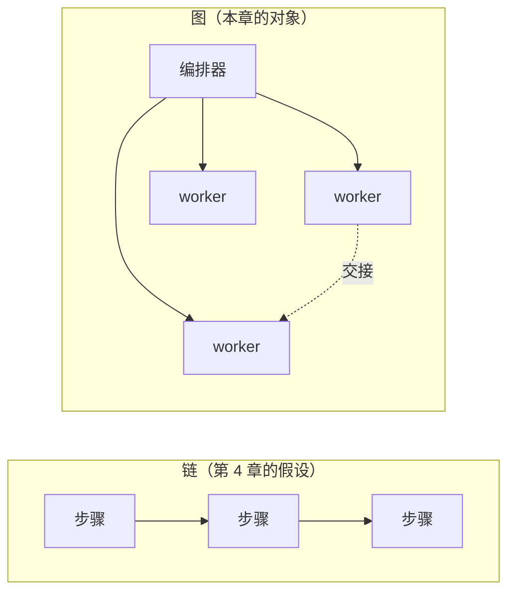

# 第 7 章 · 从链到图：多智能体系统的可靠性

> 所属：第二部分 · 核心能力  ·  [← 返回目录](../README.md)

## 为什么"链"不够了

凌晨的告警：一个"研究"编排器把任务拆给 4 个子 agent 并行查资料，其中一个把一段**猜测**当成了结论返回。编排器没有核对，直接把它当事实喂给了下游的"撰写"agent，后者又据此调用了写操作。等你查清楚，错误已经在四条支线里各自发酵了一轮——而复盘会上没有人说得清"这个错误结论是谁负责的"。

[第 6 章](06-AI自治与上下文架构约束.md) 守住的是**一个** agent 的边界：致命三角、harness、上下文。但真实系统里，agent 会调用 agent。[第 4 章](04-系统架构与复合AI可靠性数学.md) 教我们把 AI 系统看成一条**链**、算它的复合可靠性——这本书前半程的脊梁就是这条链。

这一章要显式地把这条脊梁**掰弯**：

> 当步骤不再是一条线，而是一张有并行、交接、循环的**图**时，可靠性、成本、安全、责任会以四种链上没有的方式失败。

这不是"链的进阶版"，是另一类对象。守护它，要先看清它的形状。

---

## 1 · 四种图拓扑

多智能体系统不是一个东西，至少有四种形状，可靠性画像各不相同。

| 拓扑 | 控制中枢在哪 | 主失效 | 责任落点 |
|---|---|---|---|
| 编排器-worker（hub-spoke）| 编排器持有真相源 | 编排器不核对，worker 错误被当事实 | 编排器（清晰）|
| 退化的链（pipeline）| 无中心，顺序传递 | 上游错误逐段放大 | 逐段模糊 |
| 分层（hierarchical）| 多级编排器 | 层间语义丢失、责任跨层甩锅 | 每层各一段 |
| 去中心 swarm（A2A）| 无单一控制中枢 | 死锁、涌现行为、无人负责 | 弥散（最危险）|

一条经验：**控制中枢越集中，越可诊断、越可问责**——出事时有一处可查、一个落点可问责。但要说清另一面：集中买到的是可诊断性与问责，不是可靠性本身；控制中枢同时是**单点**、也是故障的汇聚处（正是[第 11 章](../架构/01-AI系统参考架构.md)说的"控制面出错会在能力面放大"、网关 G 过载会让全站雪崩）。去中心 swarm 看起来最"智能"，却是可靠性上最难守的形状——因为它把"谁持有真相、谁负最终责"这两件事一起打散了。

---

## 2 · 图论可靠性数学：从步数到扇出

[第 4 章](04-系统架构与复合AI可靠性数学.md) 算的是链：n 步、每步正确率 p，端到端约 p^n。这套链式基线在图上仍然成立——但拿它算图之前，先要拆穿一个错觉。

先看一笔账：

- 链：5 步、每步 0.95 → 0.95⁵ ≈ **0.77**。
- 图：编排器扇出给 4 个 worker，每个是 3 步链（0.95³ ≈ 0.857）；合并要求 4 个都对 → 0.857⁴ ≈ **0.54**。

看起来图更差。但 0.857⁴ 恰好等于 0.95¹²——0.857 就是 0.95³，四个 3 步 worker 合起来正是 12 个节点。**这张图的可靠性，和一条 12 步串链一模一样。** 从 0.77 掉到 0.54，跌的全是步数（5 → 12），不是拓扑：把这 12 步拉成一条直线，端到端还是 0.54。

所以第一个要点是：**"全部都对才算数"的并行合并（AND），在可靠性上等价于一条等长的串链——并行买的是时延，不是可靠性。** 关键路径从 12 步缩到 3 步，墙上时钟快了，但"要求全对"的联合正确率一点没变。单靠 p^n 这条乘积公式，算不出任何"图特有"的惩罚；图真正的危险，恰恰藏在这条乘积公式**算不到**的地方。

**其一，共因失效（共享上游）。** 0.857⁴ 假设 4 个 worker 独立失败。但真实的图里它们常共享同一个模型、同一段检索、同一个工具——这时它们不是"4 次独立抽签"，而是**同一个判断被复制了 4 份**。共享上游一旦错，k 条支线一起错、且错得彼此吻合，你在合并处做的任何交叉校验、多数表决都形同虚设（大家从同一个坑里打水）。独立乘积既没算进这种共因，也把"扇出成 4 份"误当成了"4 重冗余"。这才是**扇出放大**的真正含义：一个错误的中间结论被 k 个下游当输入，同时污染 k 条支线——是错误传播，不是独立概率。

**其二，无 verifier 的静默合并。** 合并处没有 verifier 时，某条支线"自信地错"会被当事实并进结果。这种失败根本不在 0.857 里——乘积公式只数**看得见的 miss**，数不到"返回了一个像模像样的错答案、还被下游采纳"。所以 0.54 是**乐观下界**：真出事时数字上是 0.54，体感上却是"看起来没问题"。

**其三，无界循环。** agent 递归调用 agent，会把 n 从"有界"变成"无界"。p^n 在 n 增大时趋于 0，而串链的 n 是钉死的、图的 n 不是——没有 step 预算或终止保证，可靠性会**自己烧穿**（见 [深入 10](../深入/10-AI系统事故模式库.md) Pattern 4/7；[第 11 章](../架构/01-AI系统参考架构.md) Orc 的失败模式之一正是"Step 预算硬上限缺失导致单请求烧 200 步"）。

**其四，并行写冲突 / 双重提交。** 两条支线各自触发写操作、各自都"成功"，合起来却是一笔双重提交。乘积公式无处表达"两个都对、而这正是故障"——它只会把两次成功乘成更高的分。这是[前言](../00-前言.md)那 47 笔退款的并行版：那里是一个 agent 循环刷了 47 笔，这里是并行支线各刷一笔，根子都是写操作没有幂等边界。

最后还有一件不改变乘积、却把上面四条一起放大的事：**交互接缝随规模平方级增长**。m 个能两两通信的 agent，交互对约 m(m-1)/2 ≈ m²/2——和 [深入 04](../深入/04-为什么简单你好也消耗数万token.md) 里 token 累计**同阶**（都是平方级），只是这里数的不是 token，是**接缝**：每一对通信都是一处上下文可能丢失、可能被投毒的接口。接缝越多，共因失效与静默合并的入口就越多。

结论和第 4 章一致，只是更硬：乘积公式给的是"独立、可检测、有界、无副作用"四个假设下的**乐观下界**，真实的图把四个假设全破了。所以纪律不是算一个更吓人的数，而是**按边**上 verifier、幂等与 step 预算——第 4 章算过"加一个 verifier 值多少钱"，在图上这笔账要按**边**来算，而不是按整条链算一次。

---

## 3 · 图特有的失效模式

有些失效链上根本不存在，只在图上出现。已在事故模式库里的，标了 Pattern 号；标"（新）"的是 [深入 10](../深入/10-AI系统事故模式库.md) 目前还没有、建议回流收录的：

- **级联幻觉 / 洗白（新）**：下游 agent 把上游的猜测当既定事实，错误在交接处"洗"成了权威输入。
- **交接语义丢失（新）**：上下文在 agent 边界被截断或改写，接收方看到的和发送方以为发出的不是一回事。
- **死锁 / 活锁（新）**：agent 互相等待或循环委派，任务卡住却不报错。
- **并行写冲突 / 双重提交（新）**：两条支线各自触发写操作、各自都成功，合起来是一笔双重提交（[前言](../00-前言.md)那 47 笔退款的并行版）。串链一次只有一个写入方，图上有多个。
- **成本失控**：递归扇出让 token 与调用数指数增长（Pattern 4/7）。
- **涌现越权（新）**：单个 agent 都在 harness 边界内，组合起来却越过了边界（呼应第 6 章致命三角）。
- **工具返回投毒跨 agent 传播**：Pattern 5 在图上传得更远——一个 agent 被投毒，污染扩散到它触达的所有节点。

> [!TIP]
> 团队沟通时，让这些失效模式和深入 10 的 Pattern 一样可以用名字简称（"这次是级联幻觉"）。给失效命名，是把图从"玄学"拉回"可讨论工程"的第一步。

---

## 4 · 给图设边界：控制中枢的四件事

守护一张 agent 图，落到四个可交付的动作上：

1. **单一编排器持有真相源**：把 [第 11 章参考架构](../架构/01-AI系统参考架构.md) 里的 Orc（编排器，在四面里属**能力面**）在图中当作**控制中枢**——真相与最终决定权收敛到一处，不散在 worker 里。
2. **每条边加 verifier / schema 契约**：把第 4 章的 verifier 经济学下沉到**边**。交接处校验格式与关键事实，别让猜测被当事实洗过去。
3. **全局预算 + 深度 / 扇出上限**：给整张图设 step / depth / fan-out 的硬上限，堵住递归自烧（Pattern 4/7）。
4. **图级 trace**：每个 agent、每条边都可归因（接 [第 8 章质量可观测性](07-质量可观测性与DataFlywheel.md)、[深入 17 网关 trace](../深入/17-LLM网关的SRE视角.md)）。出事时能回答"哪个节点先错的"。

---

## 5 · 责任弥散：谁对整张图签字

[结语](../99-结语.md) 说：执行可以被整层外包，唯独判断连着责任无法一起外包。图把这句话又推进了一层——当**一群** agent 在自主协作，"谁在判断"这件事本身也被打散了。出事时最难回答的不是"哪里错了"，是"**谁**该为这张图负责"。

所以图越自治，越需要一个**具名的人**对整张图签字：不是对某个 agent，是对这张图的组合行为。控制中枢集中（§1）不只是工程选择，也是让责任有个落点的前提——一张没有人能对其整体负责的图，不该上线。

---

## 6 · 图拓扑与成熟度

多智能体不是成熟度模型里的新一档，而是**把每一档的门槛都抬高了**：图拓扑让可观测、可靠、安全、成本、组织五个维度（[第 14 章成熟度模型](../架构/04-AI-SRE成熟度模型.md)）都变得更难达标。就拿可观测说：单 agent 达标只要一条读得懂的 trace，图上则要能把跨 agent 的调用拼成一条**因果链**、答得出"哪个节点先错"——同样叫 L3，门槛已经不是一回事。一个团队在单 agent 上是 L3，换成 agent 图未必还是 L3——要按图重新自评。

---

## 7 · 这一章的产出物

- agent 图拓扑图（哪种形状、控制中枢在哪）
- 每条边的契约 / verifier 表
- 全局预算 + 深度 / 扇出上限配置
- 图级 trace 方案
- 图级责任 RACI：谁对整张图签字

---

## 这一章不讨论什么

- **不做 agent 框架横评**：框架选型是 [深入 19](../深入/19-模型服务框架对比.md) 的模式，本章只讲可靠性视角。
- **不教怎么写 orchestrator 代码**：这是应用工程，不是可靠性架构。
- **agent 长任务运行时的机制**（检查点、幂等落地、恢复的实现）→ 深入新篇（暂定 24）：§3 点出了并行写冲突这个失效**模式**，但怎么修不在本章展开。
- **MCP 与工具供应链**（agent 调外部工具的供应链风险）→ 深入新篇（暂定 22）。
- **实时 / 语音 / 有状态会话**：会话形态是另一个运维对象 → 深入新篇（暂定 26）。

> [!WARNING]
> **何时这条不再适用**：当单模型的上下文与能力大到"一个模型内部就能可靠地跑完整张图"、不再需要显式多 agent 编排时，本章的"图边界"工程会退化为模型内部问题——届时重审 §1 拓扑与 §4 控制中枢两节。

---

## 接下来

图建起来了，下一步是观测它的质量——静默降级在图上传得更快、藏得更深。

- **深入专题**（遇到具体问题再回查）：
    - [深入 10 · AI 系统事故模式库](../深入/10-AI系统事故模式库.md) —— 图特有失效对应的 Pattern 命名
    - [深入 17 · LLM 网关的 SRE 视角](../深入/17-LLM网关的SRE视角.md) —— 图级 trace 与跨 agent 归因

🔄 复习：[核心概念卡](../复习/核心概念卡.md) · [Active Recall 题库](../复习/Active-Recall题库.md)

---

上一章 → [第 6 章 · AI 自治与上下文架构约束](06-AI自治与上下文架构约束.md)
下一章 → [第 8 章 · 质量可观测性与 Data Flywheel](07-质量可观测性与DataFlywheel.md)
