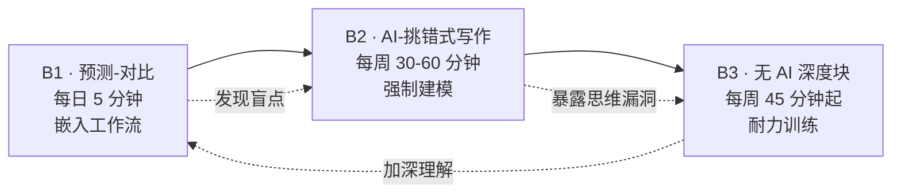

# 第 17 章 · 三个核心训练动作：B1 / B2 / B3

> 所属：第四部分 · 训练与落地  ·  [← 返回目录](../README.md)

## 为什么需要训练动作，而不是"多读多练"

[第 3 章](../理念/03-学习能力才是新的护城河.md) 已经把问题说清楚了：AI 正在从两头挤压你的学习能力——前端（输入端）跳过困惑直接给结论，后端（耐力端）把困惑期从数小时压缩到数秒。两头一挤，学习动作就被抽空。

但知道问题和解决问题是两回事。这一章给的是**具体到每天的动作**——不是"多思考"、"多练习"这类正确但无法执行的建议。这三个动作的目标很直接：**重建从困惑到理解的那条通路，并延长你能待在困惑里的时间**。

这三个动作不是额外作业。它们是第四部分所有训练单元的执行方式——Unit 0-5 的每周产出，都通过 B1/B2/B3 的方式完成。

## 三个动作之间的关系



B1 是**日常校准仪**——它让你每天看到"我以为我懂"和"我真的懂"之间的差距。B2 是**强制建模**——不许 AI 写初稿，逼你把脑子里的碎片拼成连贯的论证。B3 是**耐力训练**——延长你能在没有即时反馈的情况下思考的时间。

三个动作按顺序叠加：每天做 B1 让你发现盲点，每周做 B2 让你把盲点变成可被检验的论证，每周排一段 B3（剂量按月加）让你能啃下真正需要深度思考的问题。少一个，循环就断了。

---

## 动作 B1 · 预测-对比（每日，5 分钟）

### 做法

每次问 AI / 让 AI 写代码之前，在笔记里写两行：

```
猜：_____
不确定：_____
```

得到答案后问自己：**我错在"不知道"还是"没想到"？**

- **不知道** → 知识缺口，补上就好。这是正常的学习过程。
- **没想到** → 思维盲点，严重。说明你的心智模型有漏洞——不是缺信息，是缺推理路径。

### 为什么这个动作有效

认知科学里有一个反复验证的发现：**预测-反馈循环**是建立心智模型最高效的方式。你被动接收信息时，大脑只在做模式匹配；只有当你主动生成预测、然后对照结果时，大脑才会被迫更新内部模型。

AI 的问题在于它把"预测-反馈"这个循环压得太短了——你问一个问题，0.5 秒后得到答案，中间没有留出"生成自己预测"的窗口。B1 就是把这个窗口强行撑开——哪怕每次只有一两分钟。

### 自检信号

- **本周"没想到"超过 3 次** → 下周 B2 加码：初稿阶段全程不碰 AI——连查资料也只读一手文档和代码，不向 AI 提问（基线只要求文字不出自 AI，加码把查资料环节也收掉）
- **连续两周"不知道"为 0** → 你可能在逃避真正有挑战的问题。主动找更难的材料
- **写不出"不确定"** → 说明你在舒适区——你只问自己已经知道答案的问题。换一个你只懂 60% 的领域

### 常见误区和纠正

**误区 1 · "我每天都用 AI 写代码，没时间预测"**
预测-对比不是"额外工作"——它是你**在问 AI 之前**花 2 分钟做的事。这 2 分钟的 ROI 极高：它让你从"被动接收答案"变成"主动检验自己的理解"。如果你连 2 分钟都抽不出来，那问题不是时间不够，是你在用 AI 的方式可能已经进入"全外包"模式——这正是本书最警惕的状态。

**误区 2 · "猜对了 = 学会了"**
猜对可能只是模式匹配（你见过类似问题），不是真理解。验证方法是：一周后不用 AI，自己重新推导一遍——还能推出来，才是真学会了。

**误区 3 · "只在我做技术决策时用 B1"**
B1 适用于任何需要判断的场景——读一篇架构文档、review 别人的 PR、看一份事故报告、甚至读一篇文章。先问自己"我猜核心问题是什么/作者会怎么论证"，再读内容。这会让你的阅读从"扫一遍"变成"带着问题找答案"。

### 进阶：B1 的三种变体

| 变体 | 场景 | 预测什么 |
|---|---|---|
| **技术预测** | 调试、写代码、读文档 | 根因是什么、这段代码会输出什么 |
| **架构预测** | 读架构文档、评审方案 | 这个设计的瓶颈在哪、什么情况下会崩 |
| **行为预测** | 事故复盘、组织决策 | 为什么那个团队做了那个选择、如果你是他们你会怎么做 |

**这是三个动作里杠杆最大的一个。** 它每天只花 5 分钟，但持续做 3 个月，你会明显感觉到"我看问题的方式变了"——不是变快了，是变准了。如果你只能坚持一个动作，就留 B1。

---

## 动作 B2 · AI-挑错式写作（每周，30-60 分钟）

### 做法

1. **自己写初稿**（本周训练单元的产出文档），**不许 AI 写任何段落**。可以查资料、看书、看代码，但文字必须从你自己的脑子出来。
2. 写完后贴给 AI 当 critic：挑逻辑漏洞、技术错误、反例、遗漏的边界条件。
3. 根据反馈**自己改**，不许 AI 直接重写。AI 说"这段可以改成 XXX"，你的工作是理解为什么这样改更好，然后用你自己的话重写。

### 为什么这个动作有效

写作是**强制建模**。当你试图把脑子里模糊的想法写成清晰的段落时，你被迫把每个概念的定义、每个推理的跳跃、每个假设都显式化。模糊的想法可以自洽——"我觉得这个方案应该可行"——但写出来时，论证的裂缝会立刻暴露。

AI 跳过这一步的代价是：你脑子里有一堆"听起来对"的碎片，但从未被迫把它们拼成一条连贯的论证链。B2 就是逼你把碎片拼起来——AI 不帮你写，但帮你检查拼得对不对。

### 自检信号

- **初稿被 AI 改掉超过 30%** → 初稿太水，下周收紧。可能的原因：你在写之前没想清楚、或者你在"抄自己的模糊印象"而不是真的在论证
- **AI 挑出的错都是"表述不够精确"而不是"技术逻辑错误"** → 你的技术判断力在提升，但表达力需要单独练
- **连续三周 AI 挑不出实质性错误** → 你的材料太简单了，找更难的问题来写

### 常见误区和纠正

**误区 1 · "我先让 AI 写个框架，我再填内容"**
框架就是论证结构。论证结构是写作中最需要你亲自建的部分——它决定了你论证的骨架。让 AI 搭框架，等于把最核心的认知工作外包了。正确做法：自己先搭框架（哪怕只有 3-5 个要点），写完后让 AI 检查框架是否合理。

**误区 2 · "AI 挑的错我都改了，为什么还是没进步"**
因为你在改文字，不是在改思维。AI 说"这段逻辑跳跃"，你加了一句话补上——但你有没有想过"为什么我当时会跳过去"？那个跳跃点就是你心智模型的裂缝。修复它，不只是修复文字。

**误区 3 · "B2 太费时间，我直接写代码不行吗"**
代码也是写作。Unit 0-5 的 B2 产出包括代码、文档、架构图、SLO 定义——每一样都需要"自己先写初稿、再让 AI 挑错"。B2 不是"每周写一篇散文"，是"每周有一件产出物，是你自己先做、AI 再查"。

### B2 产出的质量自评

每周 B2 做完后，用下面三条自评：

- [ ] 这份产出能不能**让我自己一个月后回来看**，知道当时在想什么、为什么做了这个选择？
- [ ] 这份产出能不能**让一个没读过这本书的同事**看懂核心逻辑？
- [ ] 如果 AI 当场消失，我还能不能再写一份同等质量的？

三条都 yes → 这周 B2 达标。有一条 no → 下周调整。

---

## 动作 B3 · 无 AI 深度块（每周，按月渐进）

### 做法

B3 是三个动作里最难坚持的——因为它**直接对抗 AI 带来的即时反馈依赖**。它的设计原则是渐进式：从你能承受的剂量开始，慢慢加。

| 阶段 | 时长 | 做什么 | 关键规则 |
|---|---|---|---|
| **第 1 月** | 每周 45 分钟 | 读单元的一手材料（论文、文档、事故报告），**不用 AI 辅助、不用翻译插件、不查 AI 总结** | 遇到不懂的术语，先猜、再查（纸质或离线文档），不搜索 |
| **第 2-3 月** | 每周 90 分钟 | 同上 + 写读书笔记（**含一个"我不同意作者"段落**） | 笔记必须手写或用纯文本编辑器，不开浏览器 |
| **第 4 月+** | 每月 3-4 小时 | 完整离线日：啃一个本想扔给 AI 的问题 | 手机放另一个房间；只带纸、笔、需要的技术文档 |

### 为什么这个动作有效

B3 训练的不是知识——是**困惑耐受力**。你读论文第 3 页看不懂的时候，本能反应是"让 AI 解释一下"。B3 强迫你坐在那个"看不懂"的状态里，用自己的大脑去推、去猜、去画图、去试——这个过程非常不舒服，但它是心智模型生长的唯一窗口。

可以用一个比喻理解：AI 让学习变成了"坐缆车上山"——快、省力、风景好。B3 是逼你"自己爬"——慢、累、但每一步都在长肌肉。缆车上的风景和爬上去的风景是同一片，但你对山体的理解完全不同。

### 自检信号

- **做不到 45 分钟** → 从 25 分钟起步，慢慢加。**保留动作比保留剂量重要**——一周做 25 分钟 × 4 次，比一次做 90 分钟然后放弃好 10 倍
- **45 分钟里有一半时间在走神** → 正常。走神也是困惑的一部分——你的大脑在后台处理信息。关键是走神之后**回来继续**，而不是走神之后拿起手机
- **"我不同意作者"段落写不出来** → 说明你读得太被动。下次读的时候带着问题："作者在什么地方做了我不认可的假设？"

### 常见误区和纠正

**误区 1 · "我用 AI 翻译论文，然后自己读翻译稿，不算违规吧"**
算。翻译本身就是一种理解——你在翻译过程中被迫把每个句子拆开、理解每个术语的指代、判断从句的修饰关系。AI 翻译跳过的不只是语言障碍，还有理解障碍。

**误区 2 · "B3 太浪费时间，AI 时代为什么要练这个"**
因为 AI 不能替你建立心智模型。你脑子里没有模型，AI 给你再完美的答案你也判断不了它对不对。B3 练的不是"不用 AI 的能力"，是"在 AI 不存在时你仍然能思考的能力"——而这项能力恰恰是你在 AI 存在时判断 AI 的前提。

**误区 3 · "我工作中不用 AI 的时间已经很多了，不需要额外 B3"**
工作中不用 AI 的时间和 B3 是不同的。工作中的"不用 AI"通常是"在开会/在写周报/在回邮件"——这些活动不需要深度思考。B3 要求的是**主动选择一段困难的材料、在没有 AI 的情况下攻克它**——这是一种刻意练习，不是日常工作的副产品。

### B3 的材料选择指南

B3 的材料应该满足两个条件：① 你**只懂 60-70%**（不是完全不懂，也不是基本都懂）；② 它有**明确的论证结构**（不是碎片化的博文）。

推荐材料类型：
- 学术论文（系统/ML 领域，如 "Attention Is All You Need"、Raft 论文、MapReduce 论文）
- 技术书籍章节（如 Google SRE Book 的某一章、Designing Data-Intensive Applications 的某一章）
- 事故 postmortem（如 Cloudflare、GitHub、AWS 公开的事故报告）
- 架构文档（如 Kafka、Spark、Kubernetes 的设计文档）

不推荐的材料：
- 技术博客（太短、论证不完整）
- API 文档（只有事实，没有论证）
- 新闻/资讯（碎片化）
- 任何你已经在工作中读得滚瓜烂熟的材料

---

## 三个动作的联动：一个真实周示例

假设你这一周在学 Unit 3（推理 SLO 与静默降级），你的节奏是这样：

**周一至周五 · B1（每天 5 分钟）**：
每次用 AI 写代码或查资料前，在 notes 里写两行。例如：
```
猜：TTFT p99 的瓶颈应该在 prefill 阶段，因为输入长
不确定：decode 阶段受 batch size 影响有多大
```
周五回顾：本周"没想到"2 次——一次是"KV cache 耗尽时 decode 会先死而不是 prefill"，一次是"网关位延迟可能比模型延迟还大"。两个都是思维盲点，下周 B2 重点写这两个。

**周三晚 · B3（45 分钟）**：
读 vLLM 的 PagedAttention 论文第 4 节（KV cache 管理），不开 AI、不开翻译。读到一半想放弃——KV cache block 的分配算法看不懂。告诉自己"再坚持 15 分钟"。画了三张图试图理解 block 的生命周期。最后 10 分钟终于看懂了"为什么 block 可以物理不连续但逻辑共享"。写一行笔记："KV cache 的 block 和 OS 的 page table 是同一个思想。"

**周六上午 · B2（45 分钟）**：
把本周学到的静默降级检测方案写成一页文档。自己先写初稿——定义什么是静默降级、三类检测方法（canary 探针、统计分布漂移、用户反馈信号）、每类的适用场景和局限。写完后贴给 AI 挑错。AI 指出"统计分布漂移你只说了 LLM 输出 token 分布，但没考虑 embedding 向量漂移"。改掉。再检查一遍，完成。

**周日晚 · 10 分钟回顾**：
- B1：本周"没想到"2 次 → 下周 B2 重点写这两个
- B2：初稿 AI 改动率约 20% → 达标
- B3：45 分钟坚持住了，虽然有 15 分钟在走神 → 达标

---

## 什么时候可以调整动作

三个月后，如果你发现：

- B1 的"没想到"连续 4 周 < 1 次 → 你在舒适区，换更难的材料
- B2 的初稿 AI 改动率稳定在 < 15% → B2 的时间可以减到 30 分钟
- B3 的 45 分钟已经感觉"不够劲" → 按表格升到下一个阶段

但有一个底线不能动：**B1 永远不取消**。它是你每天对"我真的懂 vs 我以为我懂"的校准仪。其他两个动作可以调整剂量，但 B1 是你作为工程师的"每日体检"——一旦停止，你会慢慢回到"AI 说啥我信啥"的状态而不自知。

---

下一步 → [第 18 章 · 周循环与 19 周路线](周循环总览.md)