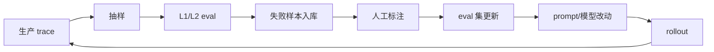

# Unit 2 · Week 4 · 合成方案 + Data Flywheel

> [← Unit 2 总览](总览.md)  ·  [← 返回目录](../../README.md)

## 本周目标

把 W1-W3 的产出**合成**为完整的 **Trace-Eval 一体化设计文档**，包含 Data Flywheel 运作流程 + 工具选型 PoC + Eval 自身的 SLO。

## 任务清单

### 阅读 · B3 · 45 分钟（无 AI）

**不读新材料**。重读 W1 的 Hamel Husain 原文：

- 对比 W1 的笔记，看**同一个句子你现在的理解和 3 周前有什么不同**
- 找出原文里**你当时 skip 了**但现在觉得重要的段落
- 特别关注"eval 自身需要的 SLO"那段

这是 Track B 最重要的能力之一：**能量化自己理解的变化**。

### 产出 · B2 · 90-120 分钟（不用 AI 写）

### 合成文档结构

**标题**：`<系统名> · Trace-Eval 一体化观测与 Data Flywheel 设计 v1`

#### 1 · 背景（100 字）
这个 AI 产品做什么？当前观测 / eval 现状？为什么要做这次设计？

#### 2 · Trace-Eval 一体化架构（来自 W1）
- 画出**一套系统**的数据流（不是两套）
- 说明为什么合一（效率？数据回流？故障检测能力？）

#### 3 · 三层 Eval 体系（来自 W2）
- L1 Assertion 清单（≥5 条）
- L2 Judge 设计 + 校准 SOP（来自 W3）
- L3 A/B 策略

#### 4 · Data Flywheel 完整循环
画出这条链：

**每一步**要有：
- **Owner**（谁负责）
- **频率**（多久跑一次）
- **触发条件**（什么时候启动）
- **失败处理**

#### 5 · Eval 自身的 SLO

Eval 挂了 = 瞎。所以 eval 也需要 SLO：

| SLI | 目标 | 测量 |
|---|---|---|
| 覆盖率 | ≥ 5% 抽样 | ... |
| 评估延迟 | p95 < 5 min | ... |
| Judge κ | ≥ 0.6 | 周度 |
| Pipeline uptime | ≥ 99.5% | ... |
| 失败率 | < 1% | ... |

定义 **error budget policy**：
- Eval 挂 > 1 小时 = 扣 10% budget
- 超预算如何处理？（暂停自动 rollback、人工 review 模式）

#### 6 · 工具选型 PoC

对比 **2-3 个候选**（Langfuse / LangSmith / Phoenix / Braintrust / 自建）：

| 维度 | 候选 A | 候选 B | 候选 C |
|---|---|---|---|
| 开源 / 自托管 | | | |
| 和你现有栈匹配度 | | | |
| OTel 兼容 | | | |
| Judge 校准支持 | | | |
| 成本（规模化后）| | | |
| 数据敏感合规 | | | |

**给出选型结论**——必须有偏好，不能"都可以"。

#### 7 · 实施路线

- P0（要上线必须先做）
- P1（上线后 3 个月内做）
- P2（nice to have）

#### 8 · 遗留风险

- 这套方案**扛不住什么**？
- 什么情况会 degrade 到无法使用？

### AI 挑错 + 红队（关键）

**分两步**：

**第一步**：AI 挑错技术细节
> "挑这份设计的技术漏洞：遗漏的指标 / 不现实的成本 / 校准方法问题 / Flywheel 环节有 bug 吗？"

**第二步**：AI 红队
> "假装你是一个恶意 / 粗心的团队成员，列出你会绕过这套 eval 体系、让不合格的东西上线的方式。"

根据第二步的反馈，**补充相应的 gate**。

### 预测 · B1 · 每日 5 分钟

本周每次看生产 issue，猜：
- "在我这套 eval 体系下，这个问题会在哪一步被捕捉？"
- 答不上来的 issue = **eval 盲点**

## 月末自检（Unit 2 结束）

按照 Unit 2 总览的 Mastery Gate：

- [ ] 三层 eval 每层 ≥3 条具体可执行检查项
- [ ] Trace ↔ Eval 统一数据流说清楚了
- [ ] Judge 有校准方法（κ 或 agreement）
- [ ] 工具选型**≥ 3 个**，每个给出**劣势**
- [ ] Flywheel **每一步都有 owner**
- [ ] Eval 自身 SLO + fallback 流程

**未达标的表现**：见 Unit 2 总览。

## 月末回顾（10 分钟）

回答：
1. 这个 Unit 之后，你对"eval"的理解 **和 Unit 2 开始前有什么不同**？
2. 如果团队真的要落地这套方案，**最大的阻力**会是什么？

对照 [每月自检表](../../附录/A-每月自检表.md) 做月评。

## 学习科学标注

- **Bloom 层级**：**综合 + 评估（Create + Evaluate）**
- **关联章节**：[深入 06 · Eval Pipeline](../../深入/06-Eval-Pipeline设计.md)、[第 7 章](../../知识/07-质量可观测性与DataFlywheel.md)

---

完成 Unit 2 → [Unit 3 · 推理 SLO 与静默降级](../Unit3-推理SLO与静默降级/总览.md)

上一步 → [Unit 2 · Week 3](Week3-Judge模型选型与校准.md)
