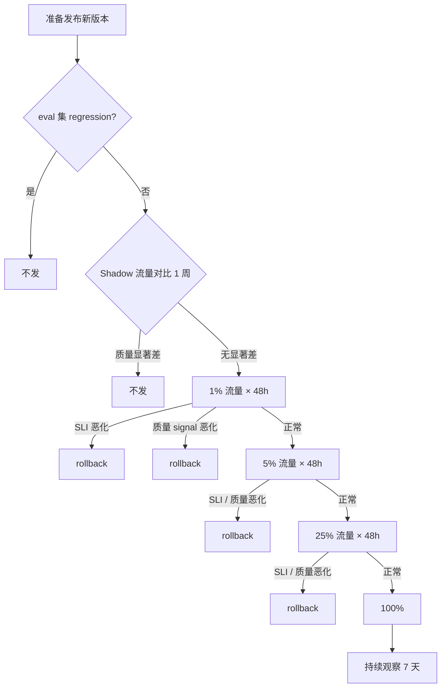

# Unit 3 · Week 4 · 灰度 / 回滚 / 影子流量决策树 + 合成

> [← Unit 3 总览](总览.md)  ·  [← 返回目录](../../README.md)

## 本周目标

做完最后一块拼图——**灰度 / 回滚 / 影子流量的决策树**，合成完整的 **Unit 3 产出文档**。

## 任务清单

### 阅读 · B3 · 45 分钟（无 AI）

**不读新材料**。这周回读：

1. Unit 3 W1-W3 自己的产出（SLI + 容量 + 静默降级）
2. Google SRE Book · Ch 4 SLO（对应 AI 化改写）

**关注**：SRE Book 讲的 rollout 原则哪些在 LLM 场景仍然适用，哪些要扩展？

### 产出 · B2 · 90-120 分钟（合成）

### 合成文档结构

**标题**：`<服务名> · 推理服务 SLO + 容量规划 + 降级检测 v1`

#### 1 · 服务概况（100 字）
- 服务做什么
- 当前规模 / 历史事故

#### 2 · SLO 体系（来自 W1）
- 三类 SLI 完整清单
- 每个的目标值
- Error budget policy

#### 3 · 容量规划（来自 W2）
- Workload 画像
- 三个容量的分别计算
- 实例数 + 预算

#### 4 · 静默降级检测（来自 W3）
- 症状谱
- 监控指标
- 故障定位树

#### 5 · 灰度 / 回滚 / 影子流量决策树（本周新产出）

**灰度决策**：

**回滚决策**：

什么 signal 必须 **立即回滚**？（p0）
- L1 assertion 通过率掉 > 10%
- P99 latency 涨 > 50%
- 错误率涨 > 2%
- Canary eval 分数掉 > 5 个点

什么 signal **需要人工介入**但不一定立即回滚？（p1）
- 按任务类型分桶的某一类掉 > 20%
- 用户 thumbs-down 率涨 > 30%
- 成本突增 > 30%（非流量涨）

什么 signal 是**观察期**？（p2）
- 任何单向缓慢漂移

**Shadow 流量机制**：
- Shadow 是双跑还是单跑？
- 对比什么（响应？token 用量？cache hit？）
- Shadow 的成本预算（shadow 会让成本翻倍）

**AB 机制**：
- 分流粒度（用户级 / 请求级）
- 样本量计算
- 主指标 / 副指标 / guardrail 指标

#### 6 · 实施路线

- P0（上线必须有）
- P1（3 月内）
- P2（nice to have）

#### 7 · 遗留风险

- 什么情况这套方案会 degrade？
- 组织协作的风险（ML 团队 vs SRE 的接口）

### AI 挑错 + 红队（关键）

**挑错**：
> "整个方案里遗漏的 signal？决策树有 bug 吗？"

**红队**：
> "假装我是一个急着发版的工程师。我会怎么绕过这些 gate？"

根据红队结果**加 hard gate**（不能靠信任）。

### 预测 · B1 · 每日 5 分钟

本周每次看到任何"模型 / 服务上线"话题，猜：
- "按我这套决策树，这次会卡在哪一步？"
- "如果出事，我在多久之内会知道？"

## 月末自检（Unit 3 结束）

按 Unit 3 总览的 Mastery Gate：

- [ ] 每个 SLI 都有目标值 + 测量方式
- [ ] 容量算清楚（Prefill / Decode / KV 分别算）
- [ ] 静默降级**有具体机制**（≥3 种症状）
- [ ] 决策树**每个分支有阈值**
- [ ] 能解释"为什么 QPS 不能是主要 scaling 指标"

## 月末回顾

1. Unit 3 之后，你对"推理服务 SLO"的理解和 3 周前有什么变化？
2. 这套方案里**最有可能在组织层面被 push back** 的是哪一部分？为什么？

对照 [每月自检表](../../附录/A-每月自检表.md) 做月评。

## 学习科学标注

- **Bloom 层级**：**综合 + 评估（Create + Evaluate）**
- **关联章节**：[第 5 章](../../知识/05-AI推理服务的可靠性工程.md)、[深入 05](../../深入/05-LLM推理服务的容量规划.md)、[深入 10](../../深入/10-AI系统事故模式库.md)

---

完成 Unit 3 → [Unit 4 · 复合 AI 系统可靠性数学](../Unit4-复合AI可靠性数学/总览.md)

上一步 → [Unit 3 · Week 3](Week3-静默降级检测.md)
