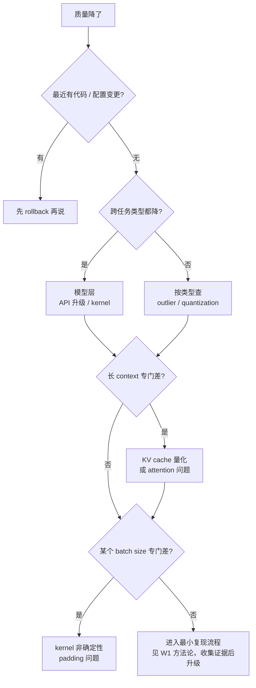

# Unit 5 · Week 2 · Runbook 产出

> [← Unit 5 总览](总览.md)  ·  [← 返回目录](../../README.md)

## 本周目标

基于上周实验经验 + 知识，产出一份**数值级故障排查 Runbook**，模板化可被团队其他人使用。

## 任务清单

### 阅读 · B3 · 45 分钟（无 AI）

**不读新材料**。回读：
- Anthropic 事故复盘（第 N 次，现在从"runbook 视角"读）
- 你自己 W1 的实验记录
- [深入 10 · Pattern 1 Silent Quality Regression](../../深入/10-AI系统事故模式库.md) 和 Pattern 12

找出：
- 如果当时你在 Anthropic 团队，你希望团队的 runbook 第一页写什么？

### 产出 · B2 · 90-120 分钟

### Runbook 结构

**标题**：`<服务名> · 数值级故障排查 Runbook v1`

#### 页 1 · 触发条件（Quick Check）

什么情况怀疑是数值级问题？（给 on-call 工程师 5 秒钟扫一眼）

- ✅ 可用性正常 + 延迟正常 + **质量明显降**
- ✅ 按任务类型分桶的 L2 均分 **一个类掉 > 1.5-2 分**，或跌出该类近 30 天波动带（p5）
- ✅ 输出长度分布突变
- ✅ 数字 / 结构化输出错误率涨 3× 以上
- ✅ 最近**有硬件更换 / CUDA 升级 / 模型量化 / kernel 库升级**
- ✅ 长 context 场景下劣化比短 context 严重

满足 2 条以上 → 走本 runbook。

#### 页 2 · 快速分层（Triage）

按优先级快速定位层级：



#### 页 3 · 数值层诊断命令集

每一类都给具体命令：

**A. 检查 bf16 vs fp32 差异**
```bash
# 准备 20 条 golden sample
python scripts/test_precision.py --model $MODEL --samples golden.jsonl
# 预期 output: 各 sample 下 bf16 和 fp32 输出是否一致
```

**B. 检查 kernel 非确定性**
```bash
# 同 prompt 重复 10 次
python scripts/test_determinism.py --prompt "..." --runs 10
# 应该全部一致；有分歧 = kernel 问题苗头
```

**C. 检查量化漂移**
```bash
# 对比量化版 vs 全精度版
python scripts/test_quantization.py --quant int4 --reference bf16
# 看每类任务的分差
```

**D. 检查版本 pin**
```bash
# 列出所有关键库的版本
pip freeze | grep -E "torch|transformers|flash-attn|vllm|cuda"
# 和已知稳定 baseline 对比
```

#### 页 4 · 常见根因库

| 症状 | 可能根因 | 验证 |
|---|---|---|
| 某类任务**精细数字错** | Quantization outlier | 实验 A |
| 长 context **偶发乱码** | Softmax 数值溢出 | 实验 C |
| 不同 batch size **结果不同** | Kernel 非确定 + padding | 实验 B |
| CUDA / PyTorch 升级后质量变 | Kernel 语义变了 | 对比 version pin |
| 模型版本切换后细微差异 | bf16 vs fp32 累积差 | 实验 A |

每条症状 → 至少一个具体的诊断命令。

#### 页 5 · Fallback / Mitigation

如果定位了但短期不能修：

- 退回上一版 kernel / PyTorch
- 临时切回全精度（牺牲成本）
- 把受影响任务类型路由到稳定 pool
- **定期发 status update**（让业务知道在修）

#### 页 6 · Postmortem 模板

出事后必填的条目：
- 症状起点时间
- 首次报警时间（和起点差了多久？= 检测盲区）
- 定位耗时（哪一步最慢？）
- 根因层级（应用 / kernel / CUDA / 硬件）
- Action items（监控 / 流程 / 工具）

### 验收标准

这份 Runbook 应该：
- [ ] **另一个没参与的同事 15 分钟内能按它定位**（让同事试读）
- [ ] **每个诊断命令都能真的跑**（你自己跑过一遍）
- [ ] 覆盖**至少 4 类**数值问题
- [ ] 包含**实验 A/B/C 的可复用脚本**

### AI 挑错 + 红队

**挑错**：
> "这份 runbook 最薄弱的是哪一节？有没有**只读理论看不出毛病但实际操作时会卡住**的地方？"

**红队**：
> "假装你是深夜 on-call。读这份 runbook 的时候，你最困惑、最想骂作者的是哪一步？"

### 预测 · B1 · 每日 5 分钟

本周每次看 LLM 服务任何异常，快速自问：
- "按我的 runbook，这该走哪一分支？"
- "能多快定位？"

## 月末自检（Unit 5 结束，全书最后一个 Unit）

按 Unit 5 总览 Mastery Gate：

- [ ] Runbook 能让**同事独立排查至少 2 类**数值故障
- [ ] 做过**至少一次真实或模拟**的 debug
- [ ] 分层流程每层**有具体命令**
- [ ] 能解释 Anthropic 事故**属于数值层面**的原因
- [ ] 最小复现方法论**可迁移**到新故障

## 月末回顾（整本书完结）

- Unit 5 之后，整个 4.5 个月下来，你最大的变化是什么？
- **回看 Unit 0**，你觉得当初理解浅的地方现在深刻了什么？
- 下一步：如何把这本书学到的东西**持续带回工作**？

对照 [每月自检表](../../附录/A-每月自检表.md) 做总评。

## 学习科学标注

- **Bloom 层级**：**综合（Create）**——产出一份可迁移的 runbook
- **关联章节**：[第 10 章](../../知识/09-工程底座.md)、[科学 03](../../科学/03-Quantization为什么有时坏.md)、[深入 10 · Pattern 1 / 12](../../深入/10-AI系统事故模式库.md)

---

**完成 Unit 5 = 完成整本书训练主线的闭环**。

**下一步（强烈建议）** → [🏆 Capstone · AI 可靠性架构评审包](../Capstone-AI生产架构评审包.md)

把你从 Unit 0-5 学到的所有内容整合成一份**可用于真实架构评审的文档**。这是你整本书学习的终极 Mastery Gate，也是最有对外价值的产出。

---

上一步 → [Unit 5 · Week 1](Week1-数值级原理.md)  ·  [📖 目录](../../README.md)
